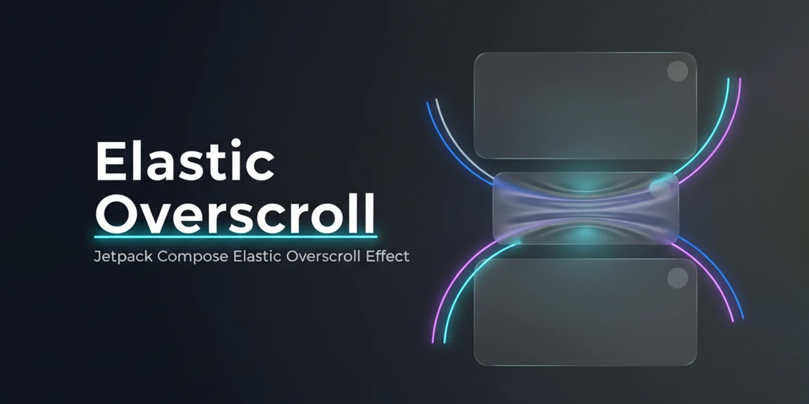

<div align="center">

<div align="center">
    <b>Due to the Iran-US war and the lack of access to some international services, we are currently unable to publish the version to the jitPack and mavenCentral repositories.</b>
    <br>
    <br>
    The versions will be published in the two repositories as soon as possible.
</div>

---



# 🌟 ElasticOverscroll for Jetpack Compose 🌟

**The ultimate, buttery-smooth iOS-like elastic overscroll effect for Android!**  
Built natively with `Modifier.Node` for maximum 60fps performance and zero unnecessary recompositions.


[]()
[](https://app.codacy.com/gh/farsroidx/andromeda/dashboard?utm_source=gh&utm_medium=referral&utm_content=&utm_campaign=Badge_grade)
[](https://opensource.org/licenses/Apache-2.0)


<div align="center">
Made with ❤️ for the Android Community.
</div>

---


<div style="margin=2px"></div>


<div style="margin=2px"></div>


</div>

---

## 🚀 Why ElasticOverscroll?

- ⚡ **Insanely Fast:** Uses Compose's `DrawModifierNode` to translate pixels directly on the canvas. **Zero recomposition** during the scroll!
- 🧲 **Advanced Physics:** Implements an exponential resistance model $$(1 - progress)^2$$ so it feels like a real physical spring.
- 🔒 **Edge Locking:** Prevent overscroll on specific edges (Full RTL support out of the box).
- 🎣 **Perfect for Pull-to-Refresh:** Built-in `onProgress` and `onReleased` callbacks.

---

## 📦 Installation

First, ensure you have the required repositories in your `settings.gradle.kts` (or `build.gradle.kts` project level):
```kotlin
dependencyResolutionManagement {
    repositoriesMode.set(RepositoriesMode.FAIL_ON_PROJECT_REPOS)
    repositories {
        google()
        mavenCentral()
        maven { url = uri("https://jitpack.io") } // Add this if you use JitPack
    }
}
```

Then, add the dependency to your app-level `build.gradle.kts`:

**Option A: Using Maven Central (`Recommended`)** [](https://mvnrepository.com/artifact/ir.farsroidx/overscroll)
```kotlin
dependencies {
    implementation("ir.farsroidx:overscroll:1.0.0")
}
```

**Option B: Using JitPack** [](https://jitpack.io/#farsroidx/ComposeElasticOverscroll)
```kotlin
dependencies {
    implementation("com.github.farsroidx:ElasticOverscroll:1.0.0")
}
```

---

## 🛠️ Usage & Modifiers

### 1. The Quick & Easy Way (For normal Columns/Rows)
If you have a standard layout that you want to make scrollable with elasticity:

```kotlin
Column(
    modifier = Modifier
        .fillMaxSize()
        .verticalElasticScrollable(
            maxStretchRatio = 30, // Stretches up to 30% of screen height
            springDampingRatio = 1f, // No wobble, crisp snap-back
        )
) {
    // Your content here
}

Row(
    modifier = Modifier
        .fillMaxSize()
        .horizontalElasticScrollable(
            maxStretchRatio = 30, // Stretches up to 30% of screen width
            springDampingRatio = 1f, // No wobble, crisp snap-back
        )
) {
    // Your content here
}
```

### 2. The `LazyColumn` / `LazyRow` Way (🚨 IMPORTANT)
For Compose `Lazy` lists, they already have their own scrolling logic. You **must** use the standard `overscrollEffect` and pass our remembered effect to it!

```kotlin
LazyColumn(
    modifier = Modifier.fillMaxSize(),
    overscrollEffect = rememberVerticalElasticOverscroll(
        maxStretchRatio = 20,
        springDampingRatio = 0.5F,
        lockedEdge = ElasticOverscrollEdgeLock.BOTTOM // Don't bounce at the bottom!
    )
) {
    items(50) { index ->
        Text("Item $index", modifier = Modifier.padding(16.dp))
    }
}

LazyRow(
    modifier = Modifier.fillMaxSize(),
    overscrollEffect = rememberHorizontalElasticOverscroll(
        maxStretchRatio = 20,
        springDampingRatio = 0.5F,
        lockedEdge = ElasticOverscrollEdgeLock.START // Don't bounce at the start!
    )
) {
    items(50) { index ->
        Text("Item $index", modifier = Modifier.padding(16.dp))
    }
}
```

---

## 🤯 Advanced Examples

### 🔥 Building a Custom Pull-to-Refresh
Want to trigger a refresh when the user pulls down enough? Use the `onReleased` and `onProgress` callbacks!

```kotlin
var pullProgress by remember { mutableFloatStateOf(0f) }

val overscrollEffect = rememberVerticalElasticOverscroll(
    maxStretchRatio = 25,
    lockedEdge = ElasticOverscrollEdgeLock.BOTTOM, // Only allow pull from the top
    onProgress = { progress ->
        pullProgress = progress // Values from 0.0 to 1.0
    },
    onReleased = { finalProgress ->
        if (finalProgress > 0.8f) {
            // Trigger your refresh action here!
            viewModel.refreshData()
        }
    }
)

Box(modifier = Modifier.fillMaxSize()) {

    LazyColumn(overscrollEffect = overscrollEffect) {
        // Items...
    }

    // Custom loading indicator that fades in based on pull progress
    if (pullProgress > 0f) {

        CircularProgressIndicator(
            progress = {
                pullProgress
            },
            modifier = Modifier.align(Alignment.TopCenter).padding(top = 16.dp),
            alpha = pullProgress
        )
    }
}
```

### ↔️ Horizontal Pager/Row with RTL Support
It works flawlessly for horizontal scrolls. If your user's device is in Arabic/Persian (RTL), `START` automatically adapts!

```kotlin
HorizontalPager(
    state = pagerState,
    modifier = Modifier.fillMaxSize(),
    overscrollEffect = rememberHorizontalElasticOverscroll(
        maxStretchRatio = 20,
        springDampingRatio = 0.5F,
        lockedEdge = ElasticOverscrollEdgeLock.START // Don't bounce at the start!
    )
) { index ->
    // Content
}

// .

Row(
    modifier = Modifier
        .fillMaxWidth()
        .horizontalElasticScrollable(
            maxStretchRatio = 15,
            lockedEdge = ElasticOverscrollEdgeLock.START // Locks the right edge in RTL, left in LTR!
        )
) {
    // Content
}
```

---

**Note: Prevents drawing outside bounds `horizontalElasticScrollableContainer()`**

---

## ⚙️ API Reference

### Configuration Parameters

| Parameter | Type | Default | Description |
| :--- | :--- | :--- | :--- |
| `maxStretchRatio` | `Int` | `25` | Maximum screen percentage the view can stretch ($1$ to $100$). |
| `springDampingRatio` | `Float` | `1f` | Bounciness of the return animation ($1f$ = critically damped/no wobble). |
| `springStiffness` | `Float` | `Medium` | Speed/stiffness of the snap-back animation. |
| `snapBackForce` | `Float?` | `null` | A multiplier to optionally increase the stiffness during touch release. |
| `lockedEdge` | `Enum` | `null` | `TOP`, `BOTTOM`, `START`, `END` - Prevents stretching on a specific edge. |
| `onProgress` | `Callback` | `null` | Emits progress from $0.0$ to $1.0$ while dragging or animating. |
| `onReleased` | `Callback` | `null` | Emits exactly once when the user lifts their finger. |

---

## 📜 License

```text
Copyright 2026 Farsroidx

Licensed under the Apache License, Version 2.0 (the "License");
you may not use this file except in compliance with the License.
You may obtain a copy of the License at

http://www.apache.org/licenses/LICENSE-2.0

Unless required by applicable law or agreed to in writing, software
distributed under the License is distributed on an "AS IS" BASIS,
WITHOUT WARRANTIES OR CONDITIONS OF ANY KIND, either express or implied.
See the License for the specific language governing permissions and
limitations under the License.
```

[](https://github.com/farsroidx)